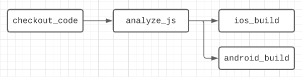
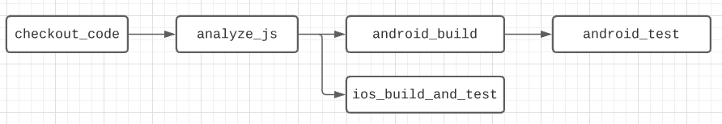
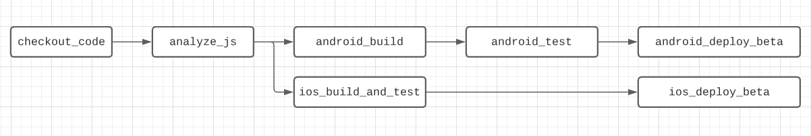
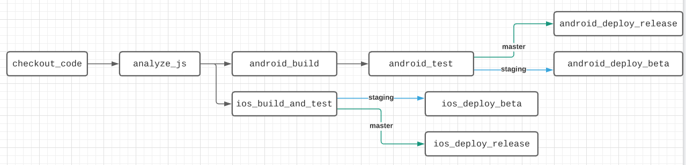

# Examples

There are 3 examples of this orb usage provided.

If you have a good example that you'd like added here, please [open a pull request](https://github.com/verypossible-labs/rn-circle-ci-orb/pulls).

## Simple (Build)

A config that handles JS tasks and builds the iOS and Android apps.

## Simple (E2E Testing)

A config that handles JS tasks, building the iOS and Android apps, and running e2e tests.

Note that this orb assumes that e2e tests are written using [Detox](https://github.com/wix/detox).

## Full (Deploy)

A config that handles JS tasks, building the iOS and Android apps, running e2e tests, and deploying beta builds via Fastlane.

You may need to tweak the deploy commands in this example to match your Fastlane configuration.

## Full (Deploy w/ Branches)

A config that emulates a typical app- extends the simple e2e config and adds deployment jobs based on the git branch the job is running on. This example also adds branch filters to avoid duplication, and assumes you're following a basic git flow pattern (feature branches, dev/staging branch, main branch).

